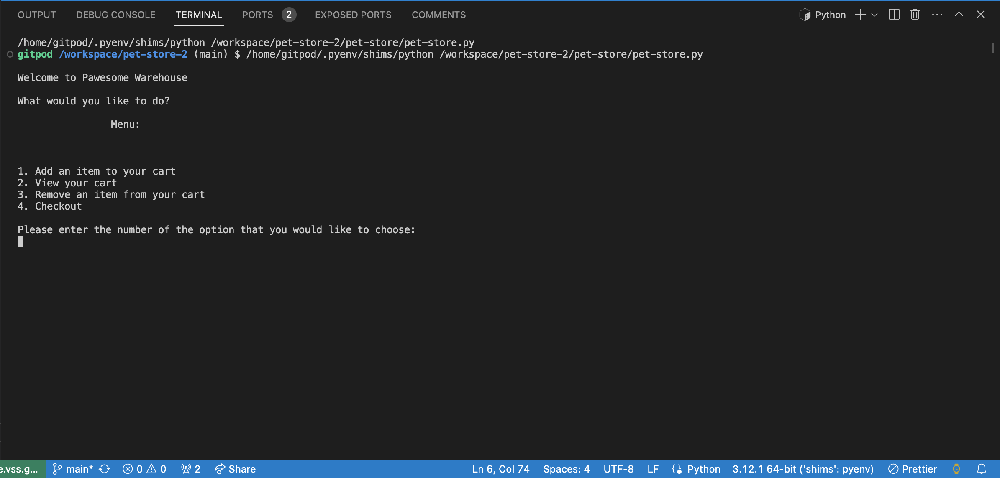
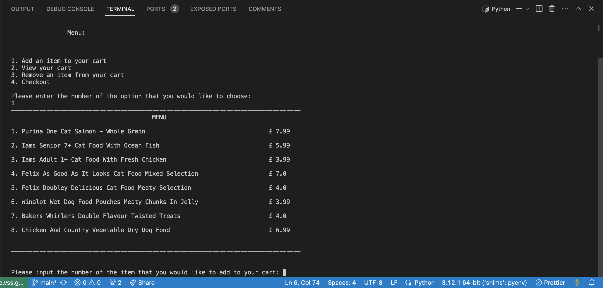
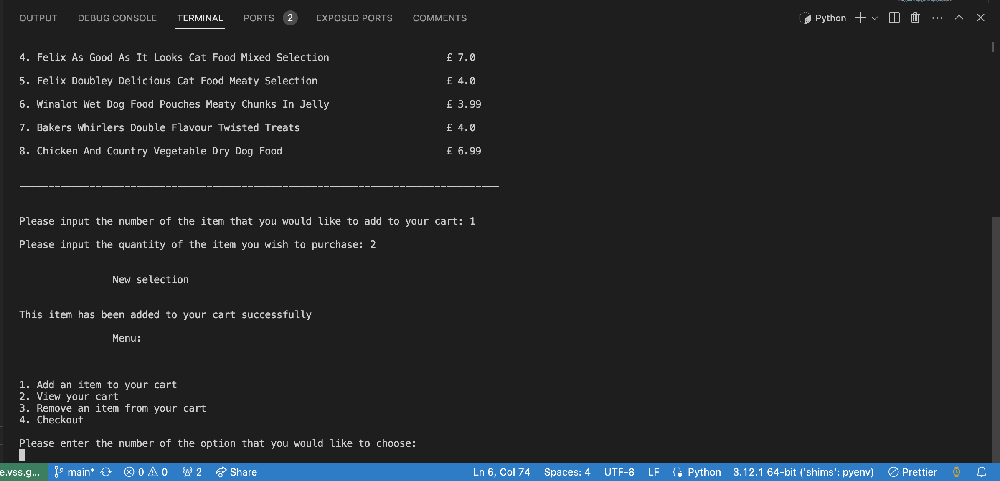
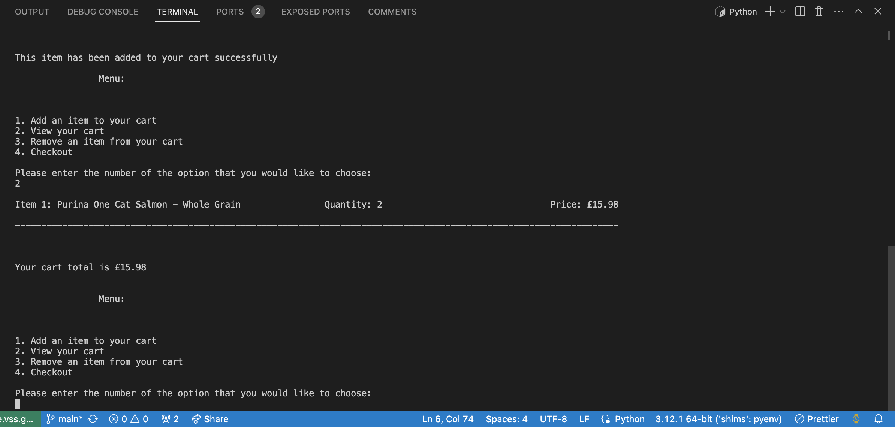
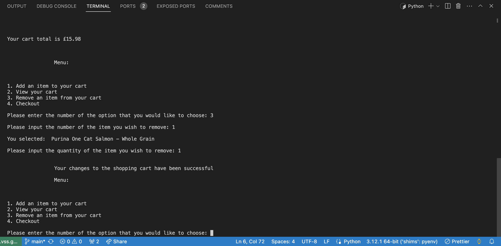
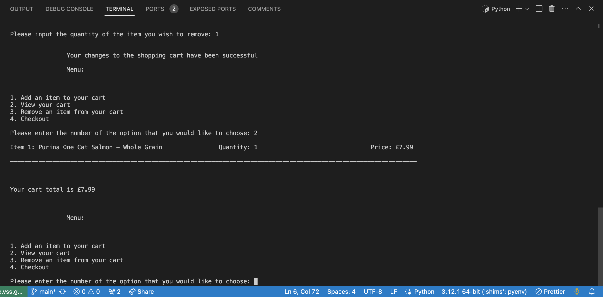
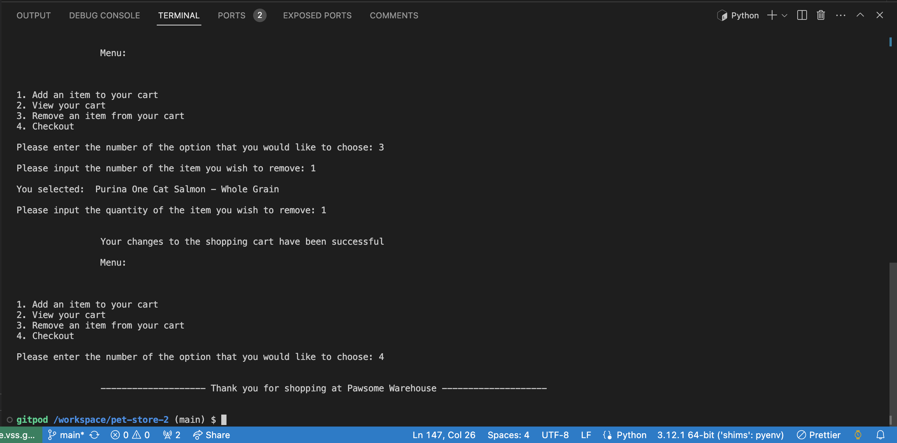

# Pet Store

### A program which enables the user to add items to a shopping cart, edit/view their cart and checkout, developed on VScode using Python.

## Languages used
* Python

# Goals
* To provide a simple to navigate program, ensuring that information is clear and concise.
* To provide a range of items for the user to choose from, marked with clear prices.
* To enable the user to remove items from the shopping cart and view an accurate total throughout before and after.
* To enable the user to view their shopping cart with an accurate depiction of what it includes, an itemised amount and total overall.
* To provide a seemless user experience incorporating error handling so that the program continues if any arise.

# Usage
* Select the triangular icon at the top right of your code editor

* Enter '1' into the terminal to add an item to your cart

* Enter the number of the item that you wish to add to your cart

* Enter '2' to view your shopping cart

* Enter '3' to remove an item from your shopping cart

* Enter '2' to view your changes to the shopping cart

* Enter '4' to exit the program

# Installation
* It is recommended to download a code editor such as VScode if you don't have one, although you can view this project in a browser.
* Go to https://github.com/cfff226/pet-store-2
* Select the repository.
* Navigate to the green button labeled 'Code'. Select 'Download ZIP'.
* Open up your code editor.
* Select 'File' and navigate to 'Open Folder' from the tab at the top of your screen. 
* Select the downloaded folder from the pop up window. 
* Open the downloaded folder, this will open all files from the zip folder in the code editor.